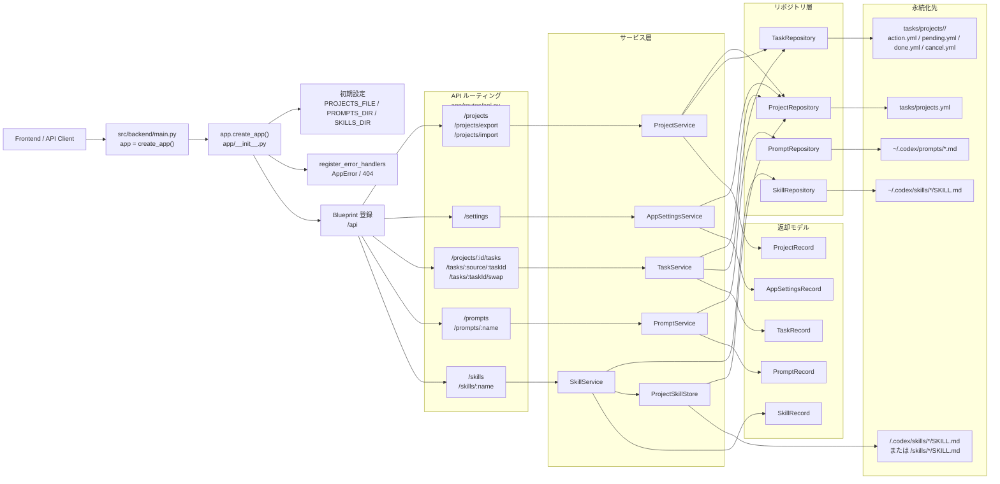

# Backend Mermaid

```mermaid
flowchart LR
  client["Frontend / API Client"] --> main["src/backend/main.py\napp = create_app()"]
  main --> factory["app.create_app()\napp/__init__.py"]

  factory --> config["初期設定\nPROJECTS_FILE / PROMPTS_DIR / SKILLS_DIR"]
  factory --> errors["register_error_handlers\nAppError / 404"]
  factory --> bp["Blueprint 登録\n/api"]

  subgraph Routes["API ルーティング\napp/routes/api.py"]
    rProjects["/projects\n/projects/export\n/projects/import"]
    rSettings["/settings"]
    rTasks["/projects/:id/tasks\n/tasks/:source/:taskId\n/tasks/:taskId/swap"]
    rPrompts["/prompts\n/prompts/:name"]
    rSkills["/skills\n/skills/:name"]
  end

  bp --> rProjects
  bp --> rSettings
  bp --> rTasks
  bp --> rPrompts
  bp --> rSkills

  subgraph Services["サービス層"]
    sProject["ProjectService"]
    sSettings["AppSettingsService"]
    sTask["TaskService"]
    sPrompt["PromptService"]
    sSkill["SkillService"]
    sProjectSkill["ProjectSkillStore"]
  end

  rProjects --> sProject
  rSettings --> sSettings
  rTasks --> sTask
  rPrompts --> sPrompt
  rSkills --> sSkill

  subgraph Repos["リポジトリ層"]
    repoProject["ProjectRepository"]
    repoTask["TaskRepository"]
    repoPrompt["PromptRepository"]
    repoSkill["SkillRepository"]
  end

  sProject --> repoProject
  sProject --> repoTask
  sSettings --> repoProject
  sTask --> repoProject
  sTask --> repoTask
  sPrompt --> repoPrompt
  sSkill --> repoSkill
  sSkill --> sProjectSkill
  sProjectSkill --> repoProject

  subgraph Storage["永続化先"]
    yProjects["tasks/projects.yml"]
    yTaskFiles["tasks/projects/<project>/\naction.yml / pending.yml / done.yml / cancel.yml"]
    yPrompts["~/.codex/prompts/*.md"]
    ySkillsGlobal["~/.codex/skills/*/SKILL.md"]
    ySkillsProject["<repository>/.codex/skills/*/SKILL.md\nまたは <repository>/skills/*/SKILL.md"]
  end

  repoProject --> yProjects
  repoTask --> yTaskFiles
  repoPrompt --> yPrompts
  repoSkill --> ySkillsGlobal
  sProjectSkill --> ySkillsProject

  subgraph Models["返却モデル"]
    mProject["ProjectRecord"]
    mSettings["AppSettingsRecord"]
    mTask["TaskRecord"]
    mPrompt["PromptRecord"]
    mSkill["SkillRecord"]
  end

  sProject --> mProject
  sSettings --> mSettings
  sTask --> mTask
  sPrompt --> mPrompt
  sSkill --> mSkill
```
