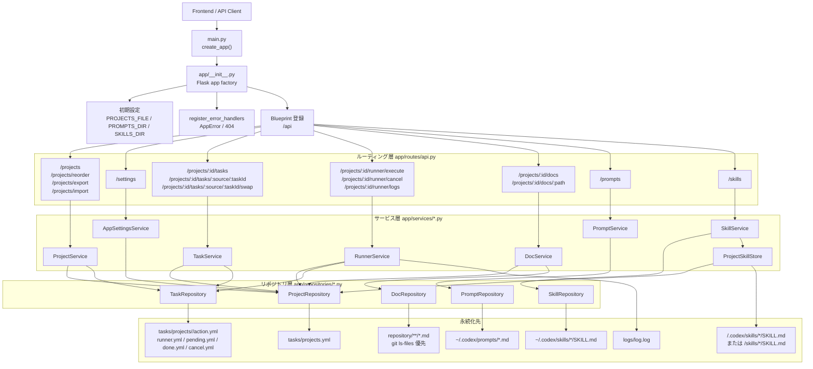
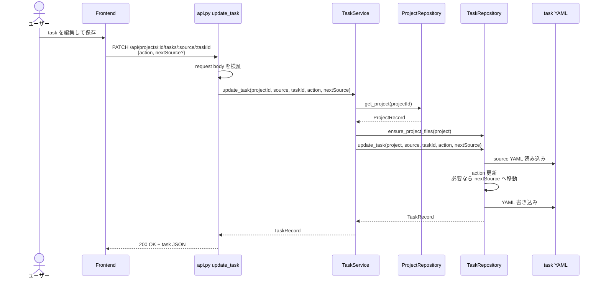
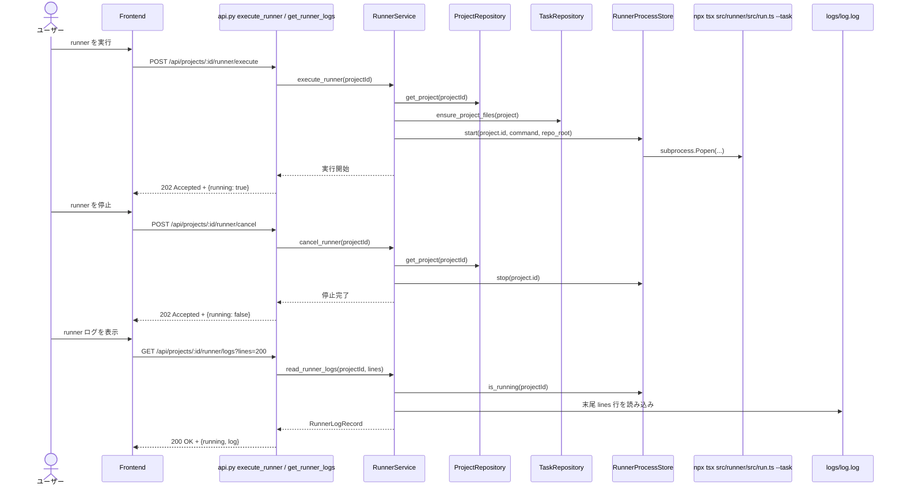
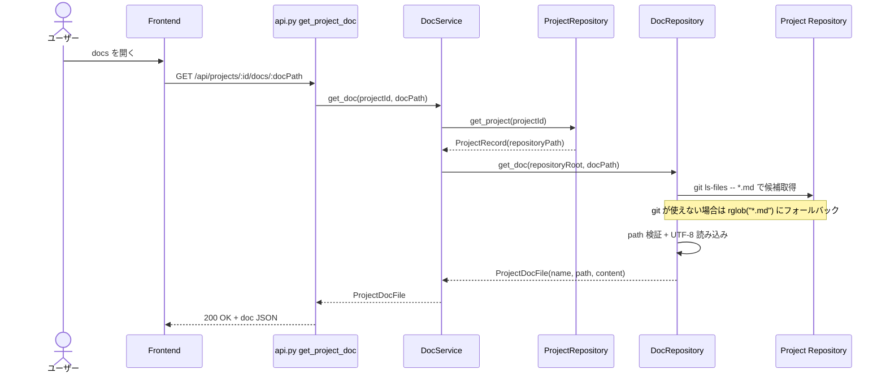

# Backend Mermaid

## API とレイヤー構成

```mermaid
%%{init: {'flowchart': {'nodeSpacing': 20, 'rankSpacing': 30}}}%%
flowchart TD
    Client["Frontend / API Client"] --> Main["main.py<br/>create_app()"]
    Main --> Factory["app/__init__.py<br/>Flask app factory"]

    Factory --> Config["初期設定<br/>PROJECTS_FILE / PROMPTS_DIR / SKILLS_DIR"]
    Factory --> ErrorHandler["register_error_handlers<br/>AppError / 404"]
    Factory --> Blueprint["Blueprint 登録<br/>/api"]

    subgraph Routes["ルーティング層 app/routes/api.py"]
      ProjectsRoute["/projects<br/>/projects/reorder<br/>/projects/export<br/>/projects/import"]
      SettingsRoute["/settings"]
      TasksRoute["/projects/:id/tasks<br/>/projects/:id/tasks/:source/:taskId<br/>/projects/:id/tasks/:source/:taskId/swap"]
      RunnerRoute["/projects/:id/runner/execute<br/>/projects/:id/runner/cancel<br/>/projects/:id/runner/logs"]
      DocsRoute["/projects/:id/docs<br/>/projects/:id/docs/:path"]
      PromptsRoute["/prompts"]
      SkillsRoute["/skills"]
    end

    Blueprint --> ProjectsRoute
    Blueprint --> SettingsRoute
    Blueprint --> TasksRoute
    Blueprint --> RunnerRoute
    Blueprint --> DocsRoute
    Blueprint --> PromptsRoute
    Blueprint --> SkillsRoute

    subgraph Services["サービス層 app/services/*.py"]
      ProjectService["ProjectService"]
      SettingsService["AppSettingsService"]
      TaskService["TaskService"]
      RunnerService["RunnerService"]
      DocService["DocService"]
      PromptService["PromptService"]
      SkillService["SkillService"]
      ProjectSkillStore["ProjectSkillStore"]
    end

    ProjectsRoute --> ProjectService
    SettingsRoute --> SettingsService
    TasksRoute --> TaskService
    RunnerRoute --> RunnerService
    DocsRoute --> DocService
    PromptsRoute --> PromptService
    SkillsRoute --> SkillService

    subgraph Repositories["リポジトリ層 app/repositories/*.py"]
      ProjectRepo["ProjectRepository"]
      TaskRepo["TaskRepository"]
      DocRepo["DocRepository"]
      PromptRepo["PromptRepository"]
      SkillRepo["SkillRepository"]
    end

    ProjectService --> ProjectRepo
    ProjectService --> TaskRepo
    SettingsService --> ProjectRepo
    TaskService --> ProjectRepo
    TaskService --> TaskRepo
    RunnerService --> ProjectRepo
    RunnerService --> TaskRepo
    DocService --> ProjectRepo
    DocService --> DocRepo
    PromptService --> PromptRepo
    SkillService --> SkillRepo
    SkillService --> ProjectSkillStore
    ProjectSkillStore --> ProjectRepo

    subgraph Storage["永続化先"]
      ProjectsYaml["tasks/projects.yml"]
      TaskYaml["tasks/projects/<project>/action.yml<br/>runner.yml / pending.yml / done.yml / cancel.yml"]
      RunnerLog["logs/log.log"]
      RepoDocs["repository/**/*.md<br/>git ls-files 優先"]
      PromptsDir["~/.codex/prompts/*.md"]
      GlobalSkillsDir["~/.codex/skills/*/SKILL.md"]
      ProjectSkillsDir["<repo>/.codex/skills/*/SKILL.md<br/>または <repo>/skills/*/SKILL.md"]
    end

    ProjectRepo --> ProjectsYaml
    TaskRepo --> TaskYaml
    RunnerService --> RunnerLog
    DocRepo --> RepoDocs
    PromptRepo --> PromptsDir
    SkillRepo --> GlobalSkillsDir
    ProjectSkillStore --> ProjectSkillsDir
```

## task 更新シーケンス

```mermaid
sequenceDiagram
    actor User as ユーザー
    participant Front as Frontend
    participant Api as api.py update_task
    participant Service as TaskService
    participant ProjectRepo as ProjectRepository
    participant TaskRepo as TaskRepository
    participant TaskYaml as task YAML

    User->>Front: task を編集して保存
    Front->>Api: PATCH /api/projects/:id/tasks/:source/:taskId<br/>{action, nextSource?}
    Api->>Api: request body を検証
    Api->>Service: update_task(projectId, source, taskId, action, nextSource)

    Service->>ProjectRepo: get_project(projectId)
    ProjectRepo-->>Service: ProjectRecord
    Service->>TaskRepo: ensure_project_files(project)
    Service->>TaskRepo: update_task(project, source, taskId, action, nextSource)

    TaskRepo->>TaskYaml: source YAML 読み込み
    TaskRepo->>TaskRepo: action 更新<br/>必要なら nextSource へ移動
    TaskRepo->>TaskYaml: YAML 書き込み
    TaskRepo-->>Service: TaskRecord

    Service-->>Api: TaskRecord
    Api-->>Front: 200 OK + task JSON
```

## runner 実行とログ取得シーケンス

```mermaid
sequenceDiagram
    actor User as ユーザー
    participant Front as Frontend
    participant Api as api.py execute_runner / get_runner_logs
    participant Service as RunnerService
    participant ProjectRepo as ProjectRepository
    participant TaskRepo as TaskRepository
    participant ProcStore as RunnerProcessStore
    participant Proc as npx tsx src/runner/src/run.ts --task
    participant LogFile as logs/log.log

    User->>Front: runner を実行
    Front->>Api: POST /api/projects/:id/runner/execute
    Api->>Service: execute_runner(projectId)
    Service->>ProjectRepo: get_project(projectId)
    Service->>TaskRepo: ensure_project_files(project)
    Service->>ProcStore: start(project.id, command, repo_root)
    ProcStore->>Proc: subprocess.Popen(...)
    Service-->>Api: 実行開始
    Api-->>Front: 202 Accepted + {running: true}

    User->>Front: runner を停止
    Front->>Api: POST /api/projects/:id/runner/cancel
    Api->>Service: cancel_runner(projectId)
    Service->>ProjectRepo: get_project(projectId)
    Service->>ProcStore: stop(project.id)
    Service-->>Api: 停止完了
    Api-->>Front: 202 Accepted + {running: false}

    User->>Front: runner ログを表示
    Front->>Api: GET /api/projects/:id/runner/logs?lines=200
    Api->>Service: read_runner_logs(projectId, lines)
    Service->>ProcStore: is_running(projectId)
    Service->>LogFile: 末尾 lines 行を読み込み
    Service-->>Api: RunnerLogRecord
    Api-->>Front: 200 OK + {running, log}
```

## docs 取得シーケンス

```mermaid
sequenceDiagram
    actor User as ユーザー
    participant Front as Frontend
    participant Api as api.py get_project_doc
    participant Service as DocService
    participant ProjectRepo as ProjectRepository
    participant DocRepo as DocRepository
    participant Repo as Project Repository

    User->>Front: docs を開く
    Front->>Api: GET /api/projects/:id/docs/:docPath
    Api->>Service: get_doc(projectId, docPath)

    Service->>ProjectRepo: get_project(projectId)
    ProjectRepo-->>Service: ProjectRecord(repositoryPath)
    Service->>DocRepo: get_doc(repositoryRoot, docPath)

    DocRepo->>Repo: git ls-files -- *.md で候補取得
    Note over DocRepo,Repo: git が使えない場合は rglob("*.md") にフォールバック
    DocRepo->>DocRepo: path 検証 + UTF-8 読み込み
    DocRepo-->>Service: ProjectDocFile(name, path, content)

    Service-->>Api: ProjectDocFile
    Api-->>Front: 200 OK + doc JSON
```
