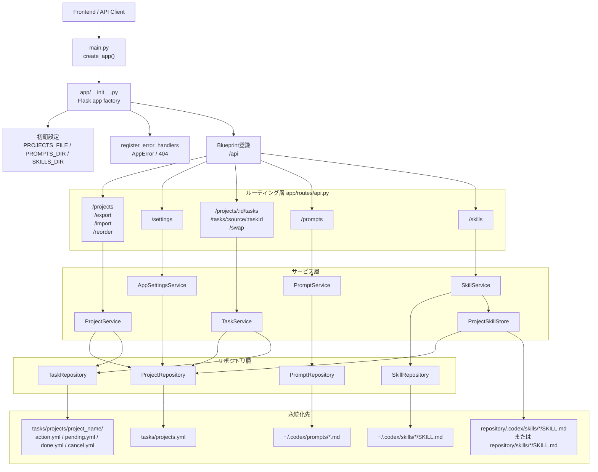
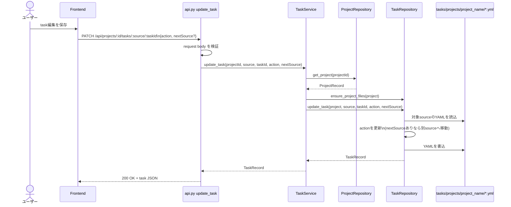

# Backend Mermaid

## APIとレイヤー構成

```mermaid
flowchart TD
  Client["Frontend / API Client"] --> Main["main.py\ncreate_app()"]
  Main --> Factory["app/__init__.py\nFlask app factory"]

  Factory --> Config["初期設定\nPROJECTS_FILE / PROMPTS_DIR / SKILLS_DIR"]
  Factory --> ErrorHandler["register_error_handlers\nAppError / 404"]
  Factory --> ApiBp["Blueprint登録\n/api"]

  subgraph Routes["ルーティング層 app/routes/api.py"]
    ProjectsRoute["/projects\n/export\n/import\n/reorder"]
    SettingsRoute["/settings"]
    TasksRoute["/projects/:id/tasks\n/tasks/:source/:taskId\n/swap"]
    PromptsRoute["/prompts"]
    SkillsRoute["/skills"]
  end

  ApiBp --> ProjectsRoute
  ApiBp --> SettingsRoute
  ApiBp --> TasksRoute
  ApiBp --> PromptsRoute
  ApiBp --> SkillsRoute

  subgraph Services["サービス層"]
    ProjectService["ProjectService"]
    SettingsService["AppSettingsService"]
    TaskService["TaskService"]
    PromptService["PromptService"]
    SkillService["SkillService"]
    ProjectSkillStore["ProjectSkillStore"]
  end

  ProjectsRoute --> ProjectService
  SettingsRoute --> SettingsService
  TasksRoute --> TaskService
  PromptsRoute --> PromptService
  SkillsRoute --> SkillService

  subgraph Repositories["リポジトリ層"]
    ProjectRepo["ProjectRepository"]
    TaskRepo["TaskRepository"]
    PromptRepo["PromptRepository"]
    SkillRepo["SkillRepository"]
  end

  ProjectService --> ProjectRepo
  ProjectService --> TaskRepo
  SettingsService --> ProjectRepo
  TaskService --> ProjectRepo
  TaskService --> TaskRepo
  PromptService --> PromptRepo
  SkillService --> SkillRepo
  SkillService --> ProjectSkillStore
  ProjectSkillStore --> ProjectRepo

  subgraph Storage["永続化先"]
    ProjectsYaml["tasks/projects.yml"]
    TaskYaml["tasks/projects/project_name/\naction.yml / pending.yml / done.yml / cancel.yml"]
    PromptsDir["~/.codex/prompts/*.md"]
    GlobalSkillsDir["~/.codex/skills/*/SKILL.md"]
    ProjectSkillsDir["repository/.codex/skills/*/SKILL.md\nまたは repository/skills/*/SKILL.md"]
  end

  ProjectRepo --> ProjectsYaml
  TaskRepo --> TaskYaml
  PromptRepo --> PromptsDir
  SkillRepo --> GlobalSkillsDir
  ProjectSkillStore --> ProjectSkillsDir
```

## task更新のシーケンス

```mermaid
sequenceDiagram
  actor User as ユーザー
  participant Front as Frontend
  participant Api as api.py update_task
  participant Service as TaskService
  participant ProjectRepo as ProjectRepository
  participant TaskRepo as TaskRepository
  participant Yaml as tasks/projects/project_name/*.yml

  User->>Front: task編集を保存
  Front->>Api: PATCH /api/projects/:id/tasks/:source/:taskId\n{action, nextSource?}
  Api->>Api: request body を検証
  Api->>Service: update_task(projectId, source, taskId, action, nextSource)
  Service->>ProjectRepo: get_project(projectId)
  ProjectRepo-->>Service: ProjectRecord
  Service->>TaskRepo: ensure_project_files(project)
  Service->>TaskRepo: update_task(project, source, taskId, action, nextSource)
  TaskRepo->>Yaml: 対象sourceのYAMLを読込
  TaskRepo->>TaskRepo: actionを更新\n(nextSourceありなら別sourceへ移動)
  TaskRepo->>Yaml: YAMLを書込
  TaskRepo-->>Service: TaskRecord
  Service-->>Api: TaskRecord
  Api-->>Front: 200 OK + task JSON
```
