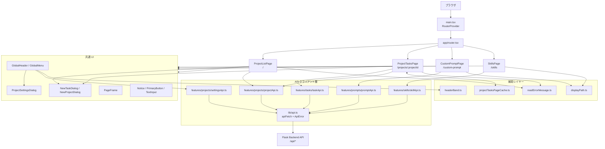
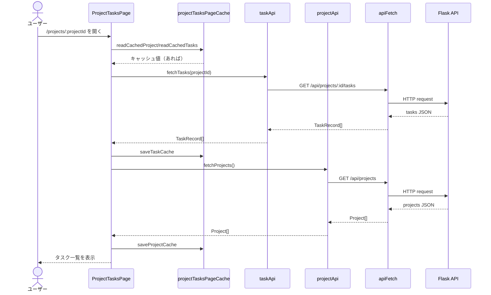
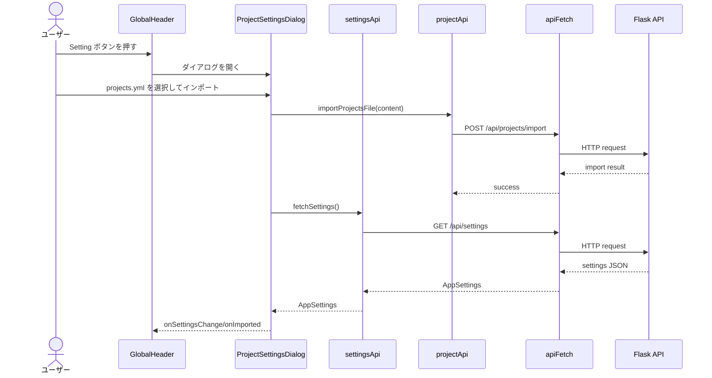

# Frontend Mermaid

## 画面とモジュール構成

```mermaid
flowchart TD
  Browser["ブラウザ"] --> Main["main.tsx\nRouterProvider"]
  Main --> Router["app/router.tsx"]

  Router --> ProjectList["ProjectListPage\n/"]
  Router --> ProjectTasks["ProjectTasksPage\n/projects/:projectId"]
  Router --> PromptPage["CustomPromptPage\n/custom-prompt"]
  Router --> SkillsPage["SkillsPage\n/skills"]

  subgraph UI["共通 UI"]
    PageFrame["PageFrame"]
    Header["GlobalHeader / GlobalMenu"]
    TaskDialog["NewTaskDialog / NewProjectDialog"]
    SettingsDialog["ProjectSettingsDialog"]
    Atoms["Notice / PrimaryButton / TextInput"]
  end

  ProjectList --> UI
  ProjectTasks --> UI
  PromptPage --> UI
  SkillsPage --> UI
  ProjectList --> TaskDialog
  ProjectTasks --> TaskDialog
  Header --> SettingsDialog

  subgraph API["API クライアント層"]
    ApiFetch["lib/api.ts\napiFetch + ApiError"]
    ProjectApi["features/projects/projectApi.ts"]
    TaskApi["features/tasks/taskApi.ts"]
    PromptApi["features/prompts/promptApi.ts"]
    SkillApi["features/skills/skillApi.ts"]
    SettingsApi["features/projects/settingsApi.ts"]
  end

  ProjectList --> ProjectApi
  ProjectTasks --> TaskApi
  ProjectTasks --> ProjectApi
  PromptPage --> PromptApi
  SkillsPage --> SkillApi
  Header --> SettingsApi

  ProjectApi --> ApiFetch
  TaskApi --> ApiFetch
  PromptApi --> ApiFetch
  SkillApi --> ApiFetch
  SettingsApi --> ApiFetch

  subgraph Utility["補助レイヤー"]
    Cache["projectTasksPageCache.ts"]
    ReadError["readErrorMessage.ts"]
    HeaderBand["headerBand.ts"]
    DisplayPath["displayPath.ts"]
  end

  ProjectTasks <--> Cache
  ProjectList --> ReadError
  ProjectTasks --> ReadError
  PromptPage --> DisplayPath
  SkillsPage --> DisplayPath
  Header --> HeaderBand

  ApiFetch --> Backend["Flask Backend API\n/api/*"]
```

## タスク一覧表示のシーケンス

```mermaid
sequenceDiagram
  actor User as ユーザー
  participant Page as ProjectTasksPage
  participant Cache as projectTasksPageCache
  participant TaskApi as taskApi
  participant ProjectApi as projectApi
  participant Api as apiFetch
  participant Backend as Flask API

  User->>Page: /projects/:projectId を開く
  Page->>Cache: readCachedProject/readCachedTasks
  Cache-->>Page: キャッシュ値（あれば）
  Page->>TaskApi: fetchTasks(projectId)
  TaskApi->>Api: GET /api/projects/:id/tasks
  Api->>Backend: HTTP request
  Backend-->>Api: tasks JSON
  Api-->>TaskApi: TaskRecord[]
  TaskApi-->>Page: TaskRecord[]
  Page->>Cache: saveTaskCache
  Page->>ProjectApi: fetchProjects()
  ProjectApi->>Api: GET /api/projects
  Api->>Backend: HTTP request
  Backend-->>Api: projects JSON
  Api-->>ProjectApi: Project[]
  ProjectApi-->>Page: Project[]
  Page->>Cache: saveProjectCache
  Page-->>User: タスク一覧を表示
```

## Setting インポートのシーケンス

```mermaid
sequenceDiagram
  actor User as ユーザー
  participant Header as GlobalHeader
  participant Dialog as ProjectSettingsDialog
  participant SettingsApi as settingsApi
  participant ProjectApi as projectApi
  participant Api as apiFetch
  participant Backend as Flask API

  User->>Header: Setting ボタンを押す
  Header->>Dialog: ダイアログを開く
  User->>Dialog: projects.yml を選択してインポート
  Dialog->>ProjectApi: importProjectsFile(content)
  ProjectApi->>Api: POST /api/projects/import
  Api->>Backend: HTTP request
  Backend-->>Api: import result
  Api-->>ProjectApi: success
  Dialog->>SettingsApi: fetchSettings()
  SettingsApi->>Api: GET /api/settings
  Api->>Backend: HTTP request
  Backend-->>Api: settings JSON
  Api-->>SettingsApi: AppSettings
  SettingsApi-->>Dialog: AppSettings
  Dialog-->>Header: onSettingsChange/onImported
```
