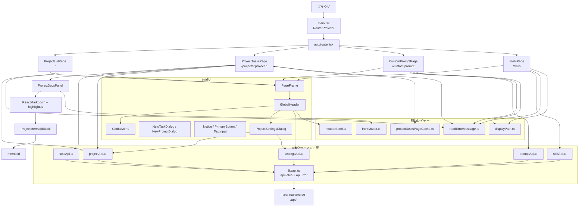
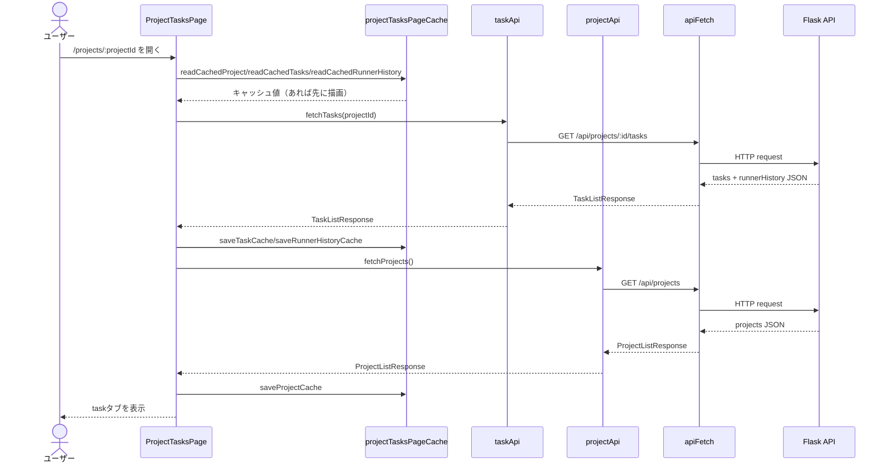
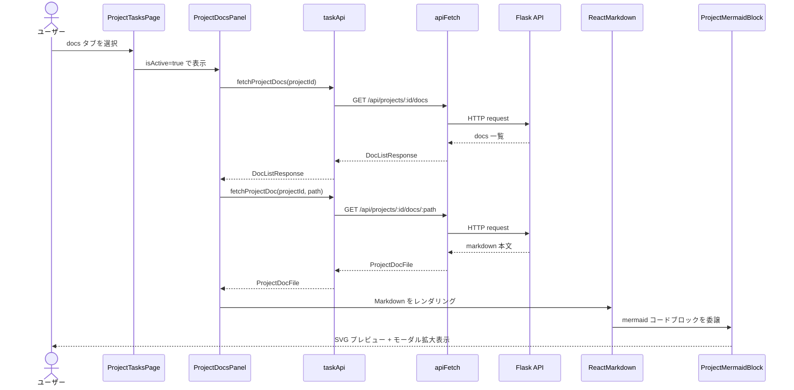

# Frontend Mermaid

## 画面・モジュール構成

```mermaid
%%{init: {'flowchart': {'nodeSpacing': 20, 'rankSpacing': 30}}}%%
flowchart TD
    Browser["ブラウザ"] --> Main["main.tsx<br/>RouterProvider"]
    Main --> Router["app/router.tsx"]

    Router --> ProjectList["ProjectListPage<br/>/"]
    Router --> ProjectTasks["ProjectTasksPage<br/>/projects/:projectId"]
    Router --> PromptPage["CustomPromptPage<br/>/custom-prompt"]
    Router --> SkillsPage["SkillsPage<br/>/skills"]

    subgraph Shared["共通UI"]
      PageFrame["PageFrame"]
      Header["GlobalHeader"]
      Menu["GlobalMenu"]
      Dialog["NewTaskDialog / NewProjectDialog"]
      Notice["Notice / PrimaryButton / TextInput"]
      SettingDialog["ProjectSettingsDialog"]
    end

    ProjectList --> PageFrame
    ProjectTasks --> PageFrame
    PromptPage --> PageFrame
    SkillsPage --> PageFrame
    PageFrame --> Header
    Header --> Menu
    Header --> SettingDialog

    ProjectTasks --> DocsPanel["ProjectDocsPanel"]
    DocsPanel --> Markdown["ReactMarkdown + highlight.js"]
    Markdown --> MermaidBlock["ProjectMermaidBlock"]
    MermaidBlock --> MermaidLib["mermaid"]

    subgraph ApiLayer["APIクライアント層"]
      ApiFetch["lib/api.ts<br/>apiFetch + ApiError"]
      ProjectApi["projectApi.ts"]
      TaskApi["taskApi.ts"]
      PromptApi["promptApi.ts"]
      SkillApi["skillApi.ts"]
      SettingsApi["settingsApi.ts"]
    end

    ProjectList --> ProjectApi
    ProjectTasks --> TaskApi
    ProjectTasks --> ProjectApi
    PromptPage --> PromptApi
    SkillsPage --> SkillApi
    Header --> SettingsApi
    SettingDialog --> ProjectApi
    SettingDialog --> SettingsApi

    ProjectApi --> ApiFetch
    TaskApi --> ApiFetch
    PromptApi --> ApiFetch
    SkillApi --> ApiFetch
    SettingsApi --> ApiFetch

    subgraph Utility["補助レイヤー"]
      Cache["projectTasksPageCache.ts"]
      ErrorUtil["readErrorMessage.ts"]
      HeaderBand["headerBand.ts"]
      DisplayPath["displayPath.ts"]
      FrontMatter["frontMatter.ts"]
    end

    ProjectTasks <--> Cache
    ProjectList --> ErrorUtil
    ProjectTasks --> ErrorUtil
    PromptPage --> ErrorUtil
    SkillsPage --> ErrorUtil
    Header --> HeaderBand
    PromptPage --> DisplayPath
    SkillsPage --> DisplayPath
    DocsPanel --> FrontMatter

    ApiFetch --> Backend["Flask Backend API<br/>/api/*"]
```

## Projectタスク画面の初期表示シーケンス

```mermaid
sequenceDiagram
    actor User as ユーザー
    participant Page as ProjectTasksPage
    participant Cache as projectTasksPageCache
    participant TaskApi as taskApi
    participant ProjectApi as projectApi
    participant Api as apiFetch
    participant Backend as Flask API

    User->>Page: /projects/:projectId を開く
    Page->>Cache: readCachedProject/readCachedTasks/readCachedRunnerHistory
    Cache-->>Page: キャッシュ値（あれば先に描画）

    Page->>TaskApi: fetchTasks(projectId)
    TaskApi->>Api: GET /api/projects/:id/tasks
    Api->>Backend: HTTP request
    Backend-->>Api: tasks + runnerHistory JSON
    Api-->>TaskApi: TaskListResponse
    TaskApi-->>Page: TaskListResponse
    Page->>Cache: saveTaskCache/saveRunnerHistoryCache

    Page->>ProjectApi: fetchProjects()
    ProjectApi->>Api: GET /api/projects
    Api->>Backend: HTTP request
    Backend-->>Api: projects JSON
    Api-->>ProjectApi: ProjectListResponse
    ProjectApi-->>Page: ProjectListResponse
    Page->>Cache: saveProjectCache

    Page-->>User: taskタブを表示
```

## docsタブでMarkdownとMermaidを表示するシーケンス

```mermaid
sequenceDiagram
    actor User as ユーザー
    participant Page as ProjectTasksPage
    participant Docs as ProjectDocsPanel
    participant TaskApi as taskApi
    participant Api as apiFetch
    participant Backend as Flask API
    participant Md as ReactMarkdown
    participant Mermaid as ProjectMermaidBlock

    User->>Page: docs タブを選択
    Page->>Docs: isActive=true で表示

    Docs->>TaskApi: fetchProjectDocs(projectId)
    TaskApi->>Api: GET /api/projects/:id/docs
    Api->>Backend: HTTP request
    Backend-->>Api: docs 一覧
    Api-->>TaskApi: DocListResponse
    TaskApi-->>Docs: DocListResponse

    Docs->>TaskApi: fetchProjectDoc(projectId, path)
    TaskApi->>Api: GET /api/projects/:id/docs/:path
    Api->>Backend: HTTP request
    Backend-->>Api: markdown 本文
    Api-->>TaskApi: ProjectDocFile
    TaskApi-->>Docs: ProjectDocFile

    Docs->>Md: Markdown をレンダリング
    Md->>Mermaid: mermaid コードブロックを委譲
    Mermaid-->>User: SVG プレビュー + モーダル拡大表示
```
