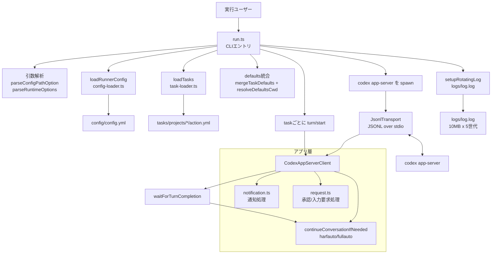
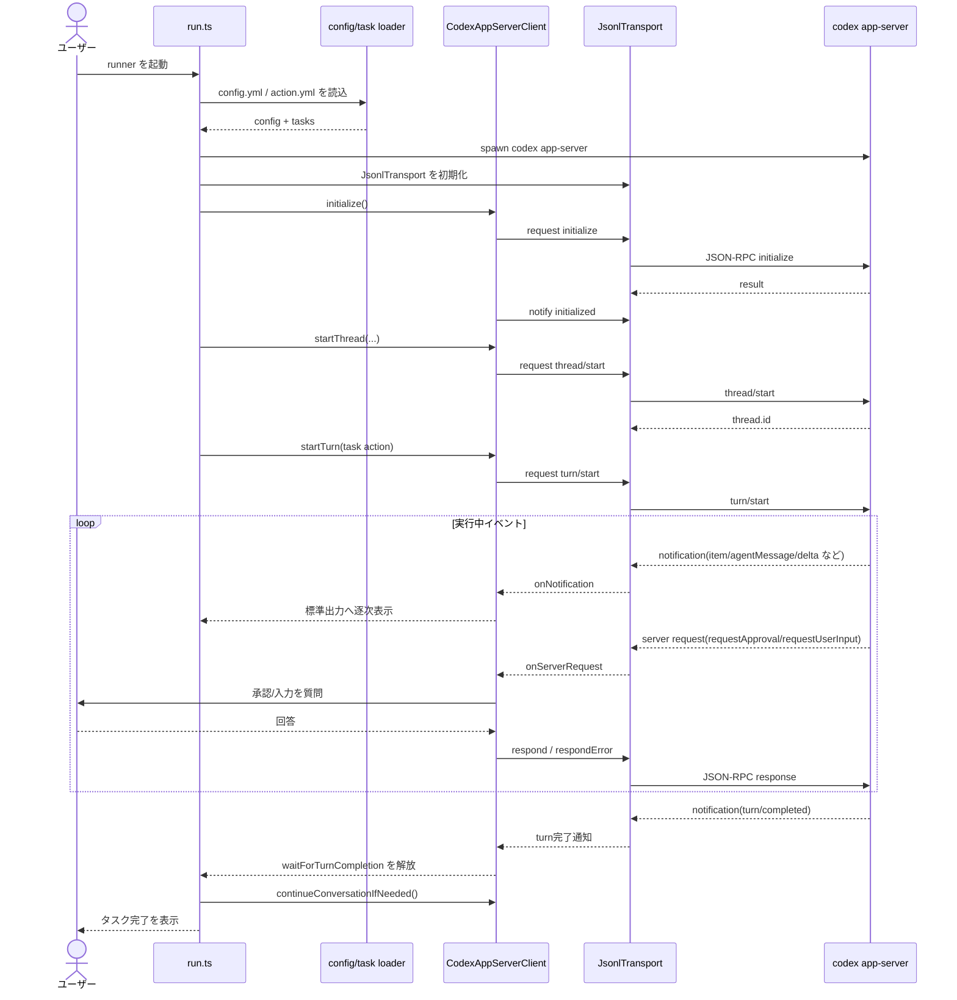

# Runner Mermaid

## 実行フローとモジュール構成

```mermaid
flowchart TD
  User["実行ユーザー"] --> CLI["run.ts\nCLIエントリ"]

  CLI --> Args["引数解析\nparseConfigPathOption\nparseRuntimeOptions"]
  CLI --> ConfigLoader["loadRunnerConfig\nconfig-loader.ts"]
  CLI --> TaskLoader["loadTasks\ntask-loader.ts"]
  CLI --> Merge["defaults統合\nmergeTaskDefaults + resolveDefaultsCwd"]
  CLI --> RotateLog["setupRotatingLog\nlogs/log.log"]

  ConfigLoader --> ConfigYml["config/config.yml"]
  TaskLoader --> ActionYml["tasks/projects/*/action.yml"]

  CLI --> Spawn["codex app-server を spawn"]
  Spawn --> Transport["JsonlTransport\nJSONL over stdio"]
  Transport --> Client["CodexAppServerClient"]

  subgraph AppLayer["アプリ層"]
    Client --> Notify["notification.ts\n通知処理"]
    Client --> Request["request.ts\n承認/入力要求処理"]
    Client --> Reply["continueConversationIfNeeded\nharfauto/fullauto"]
  end

  Transport <--> Codex["codex app-server"]

  CLI --> TaskLoop["taskごとに turn/start"]
  TaskLoop --> Client
  Client --> TurnWait["waitForTurnCompletion"]
  TurnWait --> Reply

  RotateLog --> LogFile["logs/log.log\n10MB x 5世代"]
```

## 1タスク実行時のシーケンス

```mermaid
sequenceDiagram
  actor User as ユーザー
  participant Runner as run.ts
  participant Loader as config/task loader
  participant Client as CodexAppServerClient
  participant Transport as JsonlTransport
  participant Server as codex app-server

  User->>Runner: runner を起動
  Runner->>Loader: config.yml / action.yml を読込
  Loader-->>Runner: config + tasks
  Runner->>Server: spawn codex app-server
  Runner->>Transport: JsonlTransport を初期化
  Runner->>Client: initialize()
  Client->>Transport: request initialize
  Transport->>Server: JSON-RPC initialize
  Server-->>Transport: result
  Client->>Transport: notify initialized

  Runner->>Client: startThread(...)
  Client->>Transport: request thread/start
  Transport->>Server: thread/start
  Server-->>Transport: thread.id

  Runner->>Client: startTurn(task action)
  Client->>Transport: request turn/start
  Transport->>Server: turn/start

  loop 実行中イベント
    Server-->>Transport: notification(item/agentMessage/delta など)
    Transport-->>Client: onNotification
    Client-->>Runner: 標準出力へ逐次表示
    Server-->>Transport: server request(requestApproval/requestUserInput)
    Transport-->>Client: onServerRequest
    Client->>User: 承認/入力を質問
    User-->>Client: 回答
    Client->>Transport: respond / respondError
    Transport->>Server: JSON-RPC response
  end

  Server-->>Transport: notification(turn/completed)
  Transport-->>Client: turn完了通知
  Client-->>Runner: waitForTurnCompletion を解放
  Runner->>Client: continueConversationIfNeeded()
  Runner-->>User: タスク完了を表示
```
