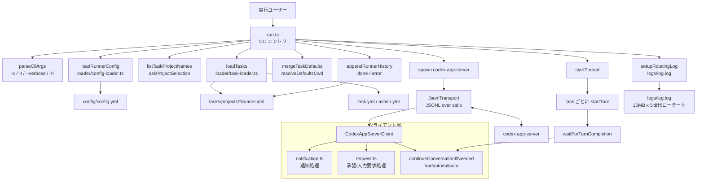
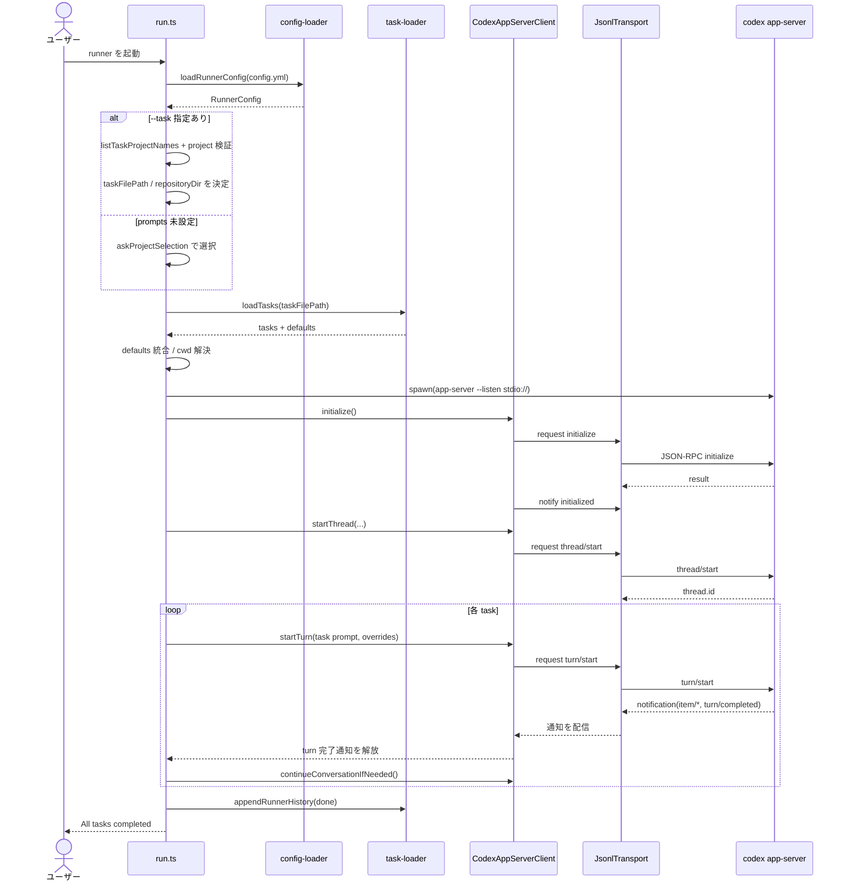
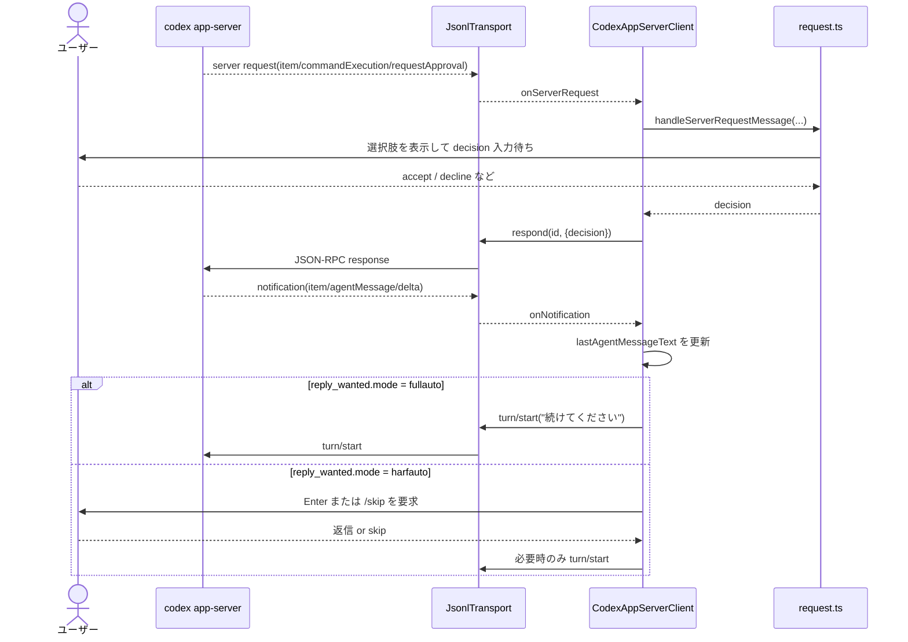

# Runner Mermaid

## 実行フローとモジュール構成

```mermaid
%%{init: {'flowchart': {'nodeSpacing': 20, 'rankSpacing': 30}}}%%
flowchart TD
    User["実行ユーザー"] --> CLI["run.ts<br/>CLI エントリ"]

    CLI --> ParseArgs["parseCliArgs<br/>-c / -t / --verbose / -h"]
    CLI --> ConfigLoader["loadRunnerConfig<br/>loader/config-loader.ts"]
    CLI --> ProjectSelect["listTaskProjectNames<br/>askProjectSelection"]
    CLI --> TaskLoader["loadTasks<br/>loader/task-loader.ts"]
    CLI --> Defaults["mergeTaskDefaults<br/>resolveDefaultsCwd"]
    CLI --> LogSetup["setupRotatingLog<br/>logs/log.log"]

    ConfigLoader --> ConfigYml["config/config.yml"]
    TaskLoader --> RunnerYml["tasks/projects/*/runner.yml"]
    TaskLoader --> TaskYml["task.yml / action.yml"]

    CLI --> Spawn["spawn codex app-server"]
    Spawn --> Transport["JsonlTransport<br/>JSONL over stdio"]
    Transport --> Client["CodexAppServerClient"]

    subgraph ClientLayer["クライアント層"]
      Client --> Notify["notification.ts<br/>通知処理"]
      Client --> Request["request.ts<br/>承認/入力要求処理"]
      Client --> ReplyLoop["continueConversationIfNeeded<br/>harfauto/fullauto"]
    end

    Transport <--> Server["codex app-server"]

    CLI --> ThreadStart["startThread"]
    ThreadStart --> TurnLoop["task ごとに startTurn"]
    TurnLoop --> WaitTurn["waitForTurnCompletion"]
    WaitTurn --> ReplyLoop

    CLI --> RunnerHistory["appendRunnerHistory<br/>done / error"]
    RunnerHistory --> RunnerYml

    LogSetup --> LogFile["logs/log.log<br/>10MB x 5世代ローテート"]
```

## 1 run 実行シーケンス

```mermaid
sequenceDiagram
    actor User as ユーザー
    participant Runner as run.ts
    participant Config as config-loader
    participant Tasks as task-loader
    participant Client as CodexAppServerClient
    participant Transport as JsonlTransport
    participant Server as codex app-server

    User->>Runner: runner を起動
    Runner->>Config: loadRunnerConfig(config.yml)
    Config-->>Runner: RunnerConfig

    alt --task 指定あり
      Runner->>Runner: listTaskProjectNames + project 検証
      Runner->>Runner: taskFilePath / repositoryDir を決定
    else prompts 未設定
      Runner->>Runner: askProjectSelection で選択
    end

    Runner->>Tasks: loadTasks(taskFilePath)
    Tasks-->>Runner: tasks + defaults
    Runner->>Runner: defaults 統合 / cwd 解決

    Runner->>Server: spawn(app-server --listen stdio://)
    Runner->>Client: initialize()
    Client->>Transport: request initialize
    Transport->>Server: JSON-RPC initialize
    Server-->>Transport: result
    Client->>Transport: notify initialized

    Runner->>Client: startThread(...)
    Client->>Transport: request thread/start
    Transport->>Server: thread/start
    Server-->>Transport: thread.id

    loop 各 task
      Runner->>Client: startTurn(task prompt, overrides)
      Client->>Transport: request turn/start
      Transport->>Server: turn/start
      Server-->>Transport: notification(item/*, turn/completed)
      Transport-->>Client: 通知を配信
      Client-->>Runner: turn 完了通知を解放
      Runner->>Client: continueConversationIfNeeded()
    end

    Runner->>Tasks: appendRunnerHistory(done)
    Runner-->>User: All tasks completed
```

## 承認要求と返信待ちのシーケンス

```mermaid
sequenceDiagram
    actor User as ユーザー
    participant Server as codex app-server
    participant Transport as JsonlTransport
    participant Client as CodexAppServerClient
    participant Request as request.ts

    Server-->>Transport: server request(item/commandExecution/requestApproval)
    Transport-->>Client: onServerRequest
    Client->>Request: handleServerRequestMessage(...)
    Request->>User: 選択肢を表示して decision 入力待ち
    User-->>Request: accept / decline など
    Request-->>Client: decision
    Client->>Transport: respond(id, {decision})
    Transport->>Server: JSON-RPC response

    Server-->>Transport: notification(item/agentMessage/delta)
    Transport-->>Client: onNotification
    Client->>Client: lastAgentMessageText を更新

    alt reply_wanted.mode = fullauto
      Client->>Transport: turn/start("続けてください")
      Transport->>Server: turn/start
    else reply_wanted.mode = harfauto
      Client->>User: Enter または /skip を要求
      User-->>Client: 返信 or skip
      Client->>Transport: 必要時のみ turn/start
    end
```
