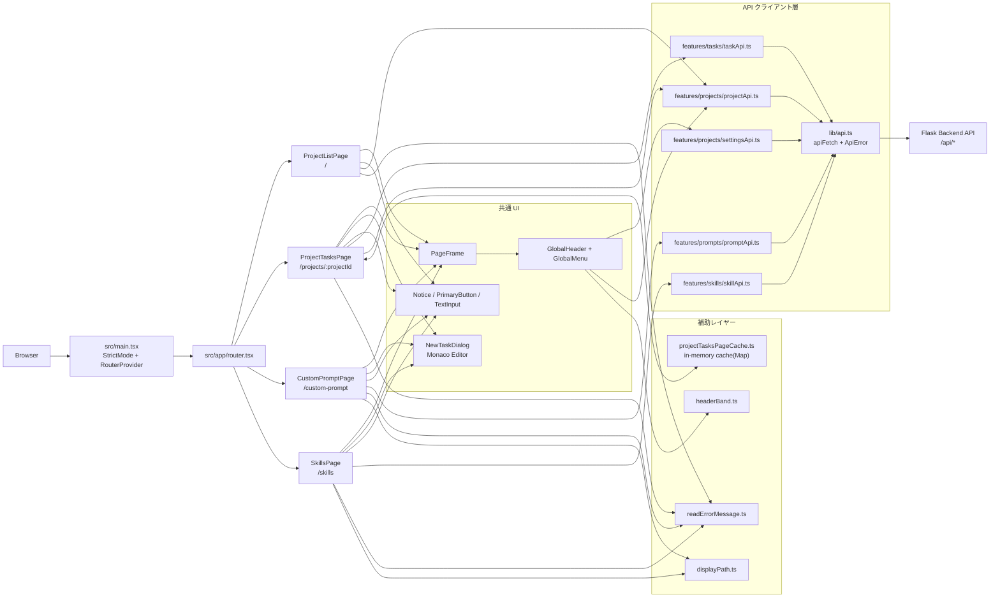

# Frontend Mermaid

```mermaid
flowchart LR
  browser["Browser"] --> main["src/main.tsx\nStrictMode + RouterProvider"]
  main --> router["src/app/router.tsx"]

  router --> pageProjects["ProjectListPage\n/"]
  router --> pageTasks["ProjectTasksPage\n/projects/:projectId"]
  router --> pagePrompts["CustomPromptPage\n/custom-prompt"]
  router --> pageSkills["SkillsPage\n/skills"]

  subgraph UI["共通 UI"]
    frame["PageFrame"]
    header["GlobalHeader + GlobalMenu"]
    dialog["NewTaskDialog\nMonaco Editor"]
    atoms["Notice / PrimaryButton / TextInput"]
  end

  pageProjects --> frame
  pageTasks --> frame
  pagePrompts --> frame
  pageSkills --> frame
  frame --> header
  pageTasks --> dialog
  pagePrompts --> dialog
  pageSkills --> dialog
  pageProjects --> atoms
  pageTasks --> atoms
  pagePrompts --> atoms
  pageSkills --> atoms

  subgraph API["API クライアント層"]
    apiFetch["lib/api.ts\napiFetch + ApiError"]
    projectApi["features/projects/projectApi.ts"]
    taskApi["features/tasks/taskApi.ts"]
    promptApi["features/prompts/promptApi.ts"]
    skillApi["features/skills/skillApi.ts"]
    settingsApi["features/projects/settingsApi.ts"]
  end

  pageProjects --> projectApi
  pageTasks --> taskApi
  pageTasks --> projectApi
  pagePrompts --> promptApi
  pageSkills --> skillApi
  header --> settingsApi
  header --> projectApi

  projectApi --> apiFetch
  taskApi --> apiFetch
  promptApi --> apiFetch
  skillApi --> apiFetch
  settingsApi --> apiFetch

  subgraph Utility["補助レイヤー"]
    cache["projectTasksPageCache.ts\nin-memory cache(Map)"]
    err["readErrorMessage.ts"]
    path["displayPath.ts"]
    band["headerBand.ts"]
  end

  pageTasks <--> cache
  pageProjects --> err
  pageTasks --> err
  pagePrompts --> err
  pageSkills --> err
  pagePrompts --> path
  pageSkills --> path
  header --> band

  apiFetch --> backend["Flask Backend API\n/api/*"]
```
